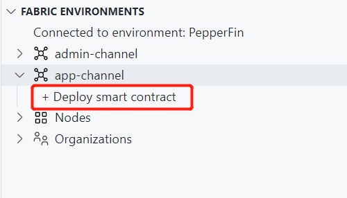
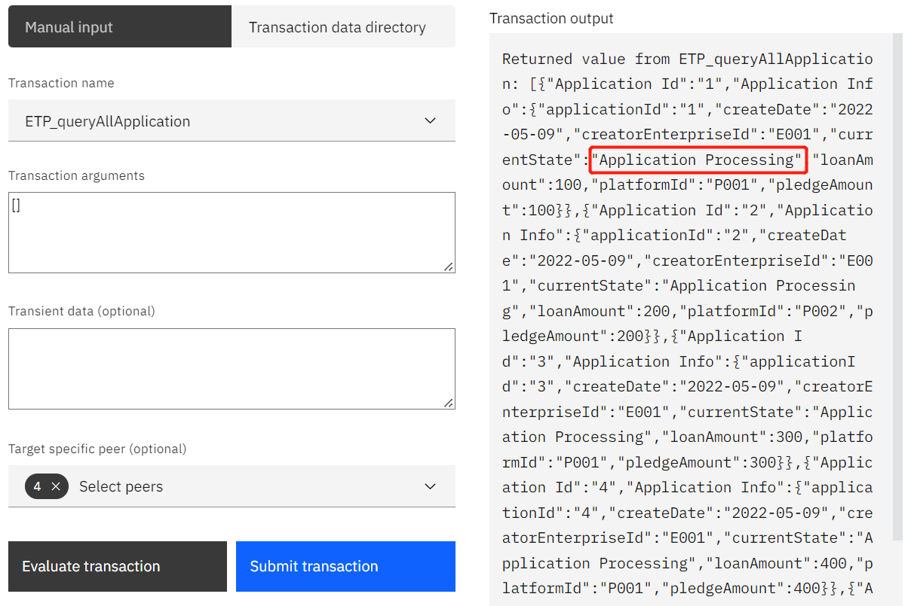

>设计与论文见[paper](./paper.pdf)

# 1 登录服务器

因为我们的应用的交互是基于VSCode的IBM Blockchain Platform插件，所以需要使用VSCode登录服务器进行操作。

使用VSCode的远程资源管理器登录服务器：

```shell
ssh ibm@8.219.67.160
psw: ibm
```
参考：[https://zhuanlan.zhihu.com/p/141205262](https://zhuanlan.zhihu.com/p/141205262)
登陆不上可以使用手机热点。

# 2 初始化、启动和连接fabric网络

1. 打开VSCode集成终端，输入指令以初始化和启动fabric网络
```shell
source /home/ibm/Document/PepperFin-ts/run-network.sh
```
2. 进入IBM Blockchain Platform插件，点击 `PepperFin` ，连接到fabric网络


如果连接不上，检查docker容器是否已经启动，否则重复步骤1。


# 3 部署链码

1. 点击  `FABRIC ENVIRONMENTS` 窗口下的  `app-channel` ->  `+ Deploy smart contract` 



2. 在弹出的  `Deploy smart contract` 窗口中，选择已经打包好的链码  `PepperFin-ts@0.0.1(packaged)` ，点击  `next` ； `Step2` 和  `Step3` 无需配置，选择  `next` 和  `Deploy` ，稍等片刻，系统将会把链码部署在网络上。


部署成功后， `app-channel` 下会出现`PepperFin-ts@0.0.1` 。


# 4 登录与Transaction的使用

本网络中一共有四个  `org` ，代表参与一个业务的四方企业， `FABRIC GATEWAYS` 栏下的四个Gateway分别是他们访问fabric网络的通道。以不同的身份登录会有不同的操作权限。


以Platform为例，如果要以Platform的身份登陆网络，访问智能合约，点击  `Platform Gateway` ，在上方的弹窗中选择  `Platform Admin` :


登录后即可以Platform的身份访问各个通道中的智能合约，点击右上角按钮可以退出登录。


其中，Transaction的前缀代表使用权限，登陆身份不匹配时则会报错：

*  `ALL` : 所有身份均可使用
*  `ETP` : 仅限融资企业使用
*  `PLT` : 仅限平台使用
*  `BNK` : 仅限银行使用
*  `WHS` : 仅限仓储使用
点击任何一个Transaction，会弹出  `Transaction View` 窗口，在这个窗口下可以进行交易的测试。


# 5 业务流程示例


## 5.1 初始化参与企业信息

分别以四个Participants的身份登录，使用  `[前缀]_init[身份]Identity` 方法，初始化信息。以  `PepperEnterprise` 为例，登录 `PepperEnterprise Admin` ，点击  `ETP_initEnterpriseIdentity` 方法，在  `Transaction arguments` 中输入 

```json
{
  "enterpriseId": "E001",
  "enterpriseName": "Enterprise001"
}
```
点击  `Submit transaction` ，右边 `Transaction output` 窗口中会提示信息录入成功。


类似地，接着分别登录  `Bank Admin` , `Platform Admin` , `Warehouse Admin` ，使用以下数据初始化各自企业信息。

*   `BNK_initBankIdentity` : 
```json
{
  "bankId": "B001",
  "bankName": "Bank001"
}
```
*  `PLT_initPlatformIdentity` :
```json
{
  "platformId": "P001",
  "platformName": "Platform001"
}
```
*  `WHS_initWarehouseIdentity` :
```json
{
  "warehouseId": "W001",
  "warehouseName": "Warehouse001"
}
```
完成所有的初始化后，以任意身份登录，可以使用 `ALL_queryAllParticipants` 方法查询到所有的参与企业信息：


## 5.2 融资企业 - 提交申请

>以融资企业身份登录。
融资企业可以使用 `ETP_submitApplication` 方法提交融资申请。

创建以下五个申请用作示例：

```json
{
  "platformID": "P001",
  "createDate": "2022-05-09",
  "loanAmount": 100,
  "pledgeAmount": 100
}
```

```json
{
  "platformID": "P002",
  "createDate": "2022-05-09",
  "loanAmount": 200,
  "pledgeAmount": 200
}
```

```json
{
  "platformID": "P001",
  "createDate": "2022-05-09",
  "loanAmount": 300,
  "pledgeAmount": 300
}
```

```json
{
  "platformID": "P001",
  "createDate": "2022-05-09",
  "loanAmount": 400,
  "pledgeAmount": 400
}
```

```json
{
  "platformID": "P001",
  "createDate": "2022-05-09",
  "loanAmount": 500,
  "pledgeAmount": 500
}
```

创建成功后，可以使用 `ETP_queryAllApplication` 方法查询改企业创建的所有申请：




可以看到，所有新创建的申请都处于 `Application Processing` 状态。

## 5.3 平台 - 处理申请

>以平台身份登录。
平台可以使用 `PLT_queryAllApplication` 方法查询所有向当前平台提交的申请：


可以看到，申请2由于申请平台是"P002"，而当前平台是"P001"，所以没有出现在当前查询结果中。

### 拒绝申请

平台可以使用 `PLT_rejectApplication` 方法拒绝融资企业的申请。

示例：拒绝申请1

```json
{
  "applicationId": "1",
  "rejectDate": "2022-05-10"
}
```
重新查询申请，此时申请1状态变为 `declined` ，新增 `rejectedDate` 属性：


注：每个transaction都有申请当前状态的检查，当申请处于不支持当前transaction的状态时，会提示错误。

### 同意申请，并向仓储企业申请服务

平台使用 `PLT_issueWSAgreement` 方法同意申请，并向仓储公司申请服务。

示例：同意申请3、4和5，并向仓储公司"W001"申请服务

```json
{
  "applicationId": "3",
  "issueWSADate": "2022-05-10",
  "warehouseId": "W001"
}
```

```json
{
  "applicationId": "4",
  "issueWSADate": "2022-05-10",
  "warehouseId": "W001"
}
```

```json
{
  "applicationId": "5",
  "issueWSADate": "2022-05-10",
  "warehouseId": "W001"
}
```

此时，三个申请的状态变为 `Pledge in Transit` ，代表抵押物正在向仓储公司转运。


## 5.4 仓储 - 签收货物

>以仓储身份登录。
仓储可以通过 `WHS_queryAllApplication` 方法查询所有与该仓储公司相关申请：


可以看到，申请3、4、5出现在查询结果中。

仓储确认收货后，使用 `WHS_signPledge` 方法签收抵押物。

示例：签收申请3、4、5

```json
{
  "applicationId": "3",
  "signDate": "2022-05-11"
}
```

```json
{
  "applicationId": "4",
  "signDate": "2022-05-11"
}
```

```json
{
  "applicationId": "5",
  "signDate": "2022-05-11"
}
```
此时，申请状态变为 `Pledge Evaluation` ，表示抵押物正在评估中。


## 5.5 仓储 - 出具评估报告

仓储对货物的评估完成后，使用 `WHS_issueReceipt` 方法出具评估报告，将申请状态变为 `Loan Risk Evaluation` ，代表此时将由平台评估贷款申请的风险。

示例：出具申请3、4、5的评估报告

```json
{
  "applicationId": "3",
  "issueDate": "2022-05-12"
}
```

```json
{
  "applicationId": "4",
  "issueDate": "2022-05-12"
}
```

```json
{
  "applicationId": "5",
  "issueDate": "2022-05-12"
}
```


## 5.6 平台 - 根据评估结果处理申请

>以平台身份登录
### 拒绝申请

平台可以通过 `PLT_rejectApplication` 方法拒绝申请，申请状态变为  `Declined` 。

示例：拒绝申请3

```json
{
  "applicationId": "3",
  "rejectDate": "2022-05-13"
}
```


### 同意申请，发放贷款

平台可以通过 `PLT_issueLoanAgreement` 方法同意申请并发放贷款，需填入发放贷款的银行id，此时申请状态变为 `Effective` 。

示例：同意申请4、5

```json
{
  "applicationId": "4",
  "issueLoanAgreementDate": "2022-05-13",
  "bankId": "B001"
}
```

```json
{
  "applicationId": "5",
  "issueLoanAgreementDate": "2022-05-13",
  "bankId": "B001"
}
```


## 5.7 银行 - 查询贷款申请

>登录银行账户。
银行可以使用 `BNK_queryAllApplication` 方法查询所有当前银行放出的贷款申请


可以看到申请4、5出现在了查询结果中。

## 5.8 企业 - 还款

>登录企业账户。
1. 对于贷款生效中的申请，企业可以使用 `ETP_redeemPledge` 方法还款并赎回抵押物，此时申请状态变为 `Pledge being Returned` ，表示抵押物正在返还中。
示例：申请4还款

```json
{
  "applicationId": "4",
  "redeemDate": "2022-05-14"
}
```


2. 收到抵押物后，企业可以使用  `ETP_signPledge` 方法签收货物，此时申请状态变为 `Terminated` ，代表业务已结束。
示例：签收申请4

```json
{
  "applicationId": "4",
  "signPledgeDate": "2022-05-15"
}
```


## 5.9 企业 - 违约

对于贷款生效中的申请，企业可以使用 `ETP_claimDefault` 方法宣布违约，此时申请状态变为 `Foreclosure` ，表示抵押物已归平台所有。

示例：申请5违约

```json
{
  "applicationId": "5",
  "defaultDate": "2022-05-14"
}
```


## 5.10 平台 - 转卖违约抵押物

>登录平台账户
对于违约的申请，平台可以使用 `PLT_sellPledge` 方法出售抵押物，此时申请状态变为 `Terminated` ，代表业务已经结束。

示例：申请5出售抵押物

```json
{
  "applicationId": "5",
  "sellPledgeDate": "2022-05-15"
}
```


